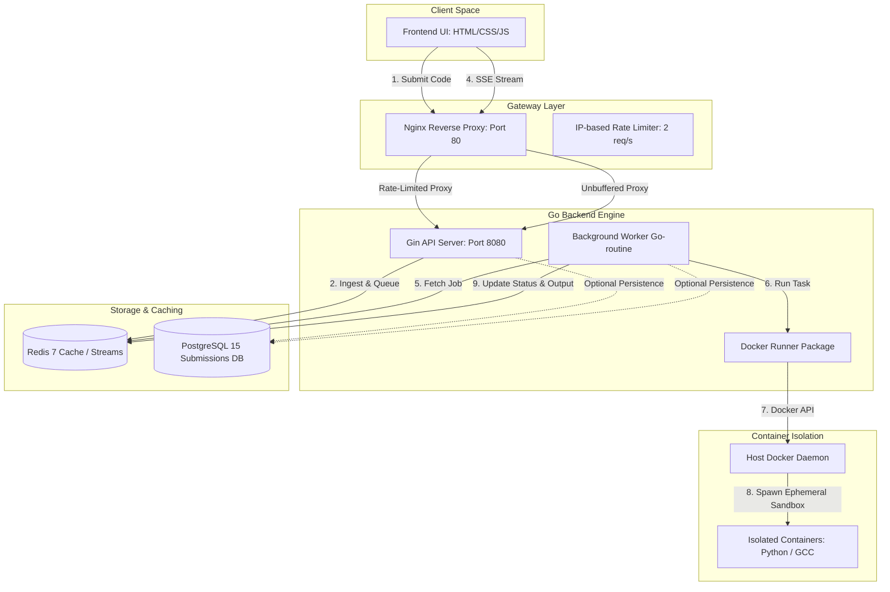
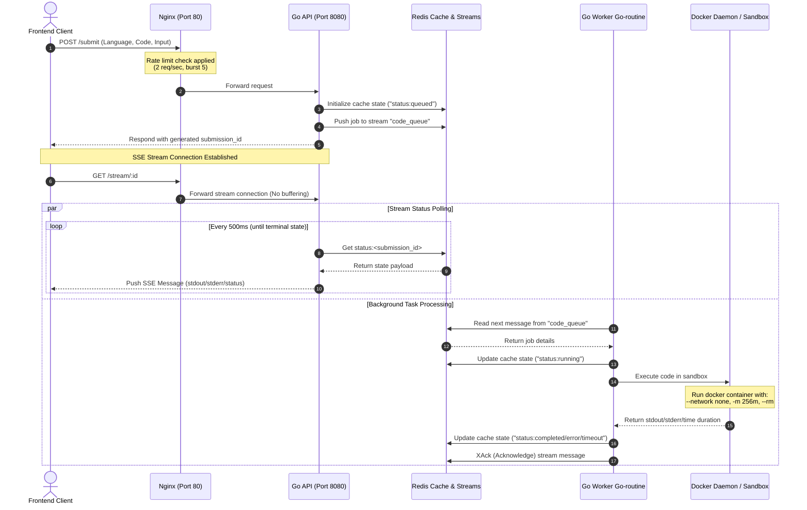

# CodeEngine 🚀


CodeEngine is a lightweight, high-performance, and secure online code execution system. It allows users to write, submit, and run untrusted code in real time inside isolated, resource-constrained Docker sandboxes. The frontend communicates with a Go backend gateway via **Server-Sent Events (SSE)** to stream execution progress and output back to the user instantly.

---

## ⚙️ Local Setup Instructions

### Prerequisites
Make sure you have the following installed on your system:
*   [Docker](https://www.docker.com/products/docker-desktop) (with Compose support enabled)
*   `bash` shell (standard on Linux & macOS)
*   `curl` (for checking API gateway readiness)

---

### Method 1: Using Automated Scripts (Recommended) 🚀

We provide helper scripts that automate the lifecycle of compilation, container startup, health checking, and cleanup.

#### 1. Set File Permissions
First, make both the start and stop scripts executable on your system:
```bash
chmod +x start.sh stop.sh
```

#### 2. Start Services
Run the startup script from the root directory to spin up the entire application stack:
```bash
./start.sh
```
*   **What this does**:
    1.  Compiles the Go binary and builds the required Docker images.
    2.  Spins up the services (`nginx`, `engine`, `redis`, `postgres`) in the background.
    3.  Polls the API gateway (`http://localhost/submit`) until it is online.
    4.  Opens `frontend/index.html` in your default browser.

#### 3. Stop Services
To stop and clean up all running services, containers, and networks, run the stop script:
```bash
./stop.sh
```
*   **What this does**:
    1.  Runs `docker compose down` to cleanly stop and remove all services.

---

### Method 2: Manual Commands 🛠️

If you prefer to orchestrate and manage the infrastructure manually, use the commands below:

#### 1. Spin Up Services
Build the container images and run them in background detached mode:
```bash
docker compose up -d --build
```

#### 2. Monitor Container Logs
To stream logs from all running containers:
```bash
docker compose logs -f
```
Or view logs from a specific container:
```bash
docker compose logs -f engine
docker compose logs -f nginx
```

#### 3. Open the Frontend
Since the startup script is bypassed, manually double-click or run:
```bash
open frontend/index.html
```

#### 4. Tear Down Services
To stop the services and release all network ports:
```bash
docker compose down
```

---

## 🏗️ System Architecture

CodeEngine follows a decoupled, distributed architecture designed for safety, speed, and real-time execution feedback.

### Component Relationship Diagram

The diagram below shows how the user client, the rate-limiting gateway, the Go execution engine, the Docker sandbox runner, and the databases/cache interact:



### The Code Submission Lifecycle

The sequence diagram below displays the step-by-step lifecycle of a code compilation/execution job:



---

## 🔍 Core Component Breakdown

### 1. Frontend Client (`frontend/`)
An interactive IDE interface styled using Vanilla CSS:
*   Submits code to `/submit`.
*   Connects to `/stream/:id` via an `EventSource` (SSE).
*   Dynamically handles compilation errors, standard output, and process timeouts.

### 2. Nginx API Gateway (`nginx.conf`)
Serves as the frontend-facing gateway (Port 80) and performs reverse-proxy routing and rate-limiting:
*   **Rate Limiting**: Protects backend services from load surges by limiting requests to `2 requests/sec` with a burst buffer of `5` using a remote IP limit zone.
*   **SSE Streaming Support**: Disables proxy buffering (`proxy_buffering off`), connection caching, and chunked transfer encoding for `/stream/` requests, allowing real-time status updates to flow without lag.

### 3. Go Engine & Worker (`main.go`)
Runs a Gin router and serves the execution flow:
*   **API Router**:
    *   `POST /submit`: Ingests code/language payload, creates a temporary status in Redis, and pushes the job to the Redis Stream.
    *   `GET /stream/:id`: Delivers SSE events by polling Redis status every `500ms`. Automatically closes the stream on terminal states (`completed`, `error`, `timeout`).
*   **Async Worker**: An asynchronous worker routine that polls the Redis Stream `code_queue` within a consumer group, processing one job at a time to distribute execution load.

### 4. Sandbox Runner (`runner/docker.go`)
Interacts with the Docker daemon via the mounted socket to spin up isolated container instances:
*   **Security Restrictions**:
    *   `--network none`: Isolated sandboxing prevents external network calls.
    *   `-m 256m`: Caps container memory usage to 256MB.
    *   `--rm`: Removes the container automatically upon completion.
*   **Supported Languages**:
    *   **Python**: Runs code inline using `python:3.10-alpine`.
    *   **C++**: Compiles and executes code inside `gcc:13.2.0` via standard gcc compilation (`g++ -O0`).
*   **Timeout Handler**: Enforces a strict 7-second time limit per run.

### 5. Datastore & Storage (`store/store.go`, `db/init.sql`)
Prepared for persistence integrations:
*   **PostgreSQL**: Configured with a schema for storing historical submissions persistently.
*   **Redis**: Serves as a fast, in-memory cache for status logs and as the queue broker for processing stream tasks.

---

## 🗄️ Repository Directory Layout

```
.
├── Dockerfile              # Configures Go runner container environment
├── db/
│   └── init.sql            # Schema definitions for PostgreSQL database
├── docker-compose.yml      # Service definitions (Nginx, Engine, Redis, Postgres)
├── frontend/
│   ├── index.html          # Interactive IDE Frontend
│   ├── style.css           # Modern IDE aesthetics & typography
│   └── app.js              # State management & SSE event handler
├── go.mod                  # Go module definition file
├── go.sum                  # Package checksum registry
├── main.go                 # Go API entrypoint & Stream Worker implementation
├── nginx.conf              # Reverse proxy, rate limiter & buffering configuration
├── runner/
│   └── docker.go           # Dynamic Docker sandbox container driver
├── start.sh                # Helper script to launch services
├── stop.sh                 # Helper script to stop services
└── store/
    └── store.go            # DB & Redis integration storage module
```
